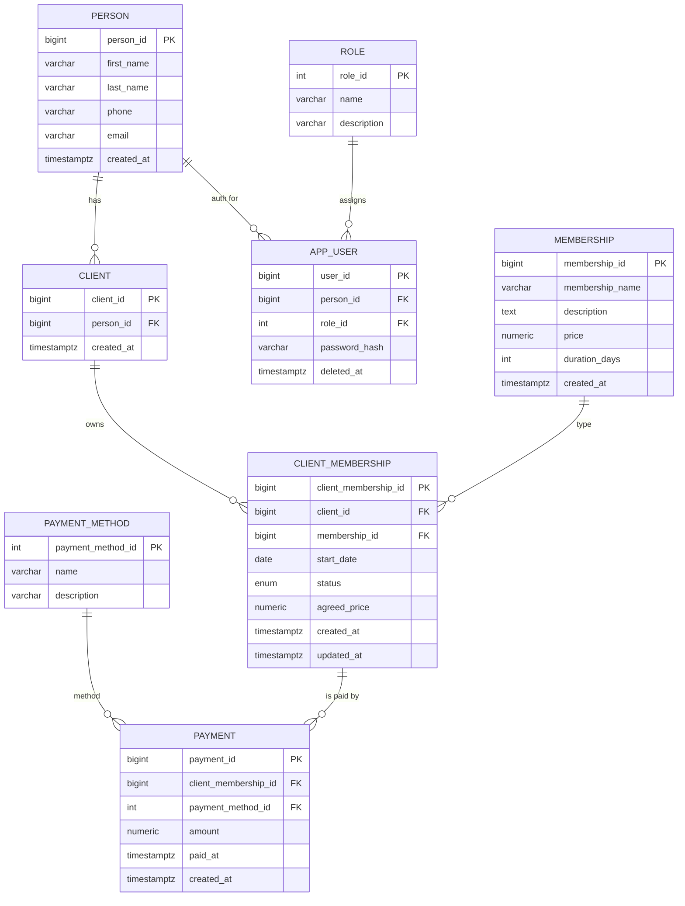

# Gymple Database Model

## Explanation

- **Person**: real-world person. Holds contact info and email (unique).
- **Client**: a person that buys memberships.
- **Role** + **AppUser**: authentication/authorization layer linked to a person.
- **Membership**: definition of membership types (name, current price, duration).
- **ClientMembership**: specific subscription of a client to a membership.
  - `agreed_price` freezes the price at signup time for traceability.
  - `status` is an enum: ACTIVE / PAUSED / CANCELLED.
- **Payment**: payments made for a client membership.
  - `paid_at` stores exact payment timestamp (TIMESTAMPTZ).
- **PaymentMethod**: cash, credit card, etc.

This model lets you:

- Change membership prices over time without losing what each client actually agreed to pay.
- Track every payment with its exact timestamp and method.
- Separate person data from user credentials, keeping the design clean and extensible.
